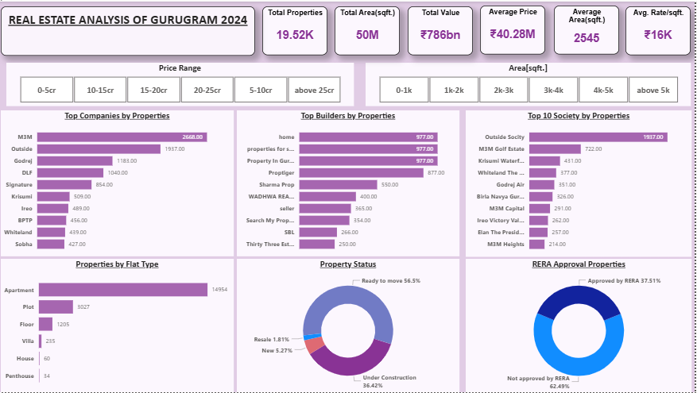
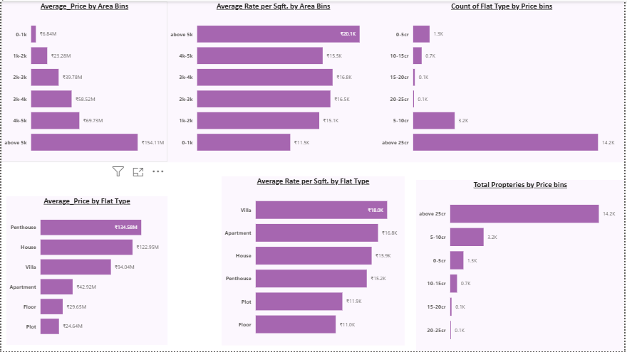

#  Gurugram Real Estate Market Analysis

## 📌 Objective  
To analyze housing trends in Gurugram and identify factors affecting property prices.  

## 📊 Dataset  
- Collected from Kaggle/real estate dataset
- ~5,000 rows with property type, location, price, and features.

## 🛠️ Tools Used    
- Power BI (Power Query, Dashboard)

  ## 🔎 Approach  
1. Data cleaning – removed duplicates, handled missing prices.  
2. Feature engineering – created new columns (price per sq. ft).
3. Created Area bins and price bins for grouping and segmentation.
4. Visualization – trends in property pricing across locations.  
5. Power BI dashboard to present insights interactively.

## 💡 Key Insights  
- The average property price stands at ₹40.28M, with an average rate of ₹16K per sqft.  
- Most properties fall into the “above 25cr” price bin (14.2K properties), indicating a predominance of high-value listings.
- The highest average price [₹154.11M] and rate per sqft [₹20.1K].
- Lower area bins (0-1k sqft) maintain more affordable average rates per sqft (₹11.5K).
- Apartments dominate the market by flat type, with 14,954 properties.
- 56.5% of properties are ready to move, while 36.42% are under construction. Only a small fraction is resale (1.81%) or new (5.27%)
- RERA approval is moderate: 37.51% of properties are approved, while 62.49% are not approved by RERA.
- RERA approval is moderate: 37.51% of properties are approved, while 62.49% are not approved by RERA
- M3M leads with the highest number of properties (2,668), followed by Outside, Godrej, DLF, and Signature Global.

- ### Dashboard screenshot 1

- ### Dashboard screenshot 2

